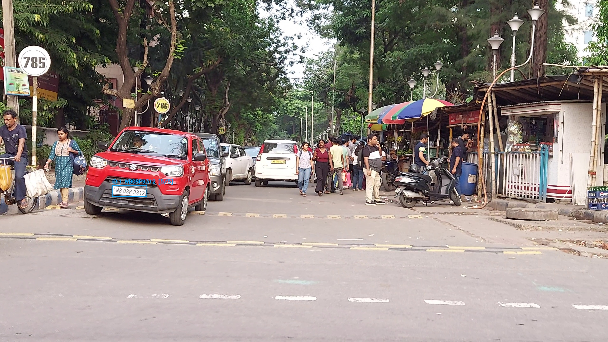
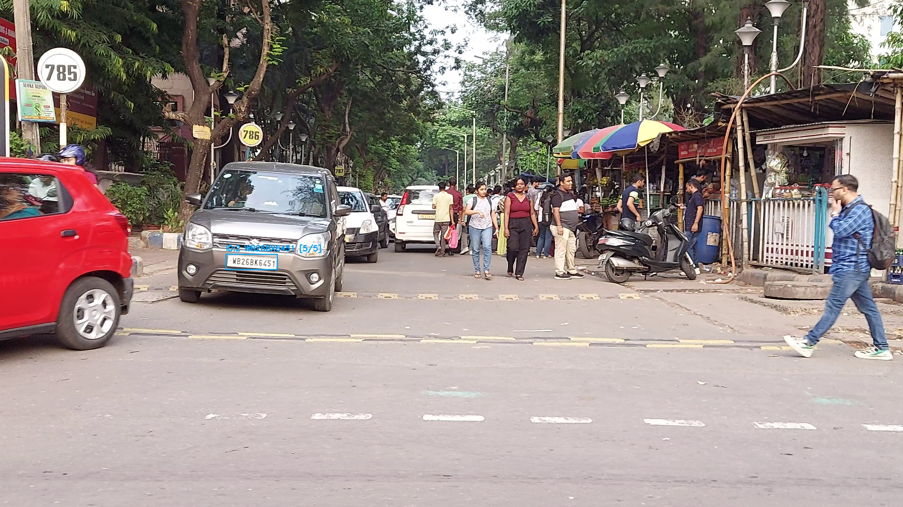
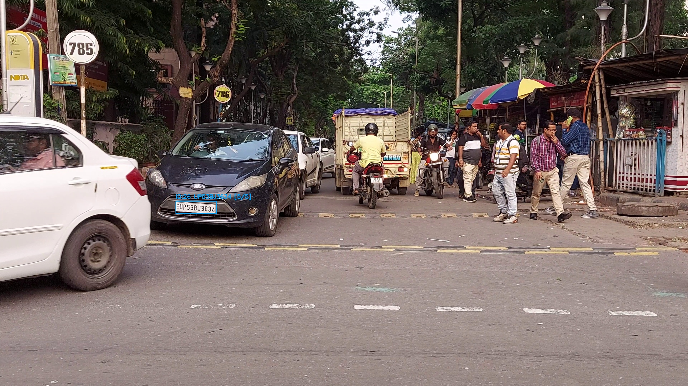

# 🚀 Indian License Plate Recognition (LPR) with Synthetic Data

I'm thrilled to share my latest **Computer Vision** project — a robust **License Plate Recognition (LPR) system** specifically designed for **Indian license plates** using **synthetic data**! 🎯

---

## 🔹 Project Agenda

The goal was to train a **YOLOv8 + EasyOCR-based LPR model** that accurately detects and reads Indian license plates in real-world conditions. Since annotated real-world data is scarce, I generated **synthetic data** to train the model effectively.

---

## 🔹 Key Steps & Methodology

### 1️⃣ Synthetic Data Generation (17,500+ Unique Plates)
- Created Indian license plates in the format:  
  `MH01AB1234`, `DL12CD5678`, etc.
- Tools: **Python + PIL **
- Added:
  - ✅ Random fonts & backgrounds  
  - ✅ Noise & blur augmentations  
  - ✅ Perspective distortions for camera realism  

### 2️⃣ Data Augmentation for Robustness
- Applied augmentations using **OpenCV** to simulate:
  - Lighting variations (brightness/contrast)
  - Gaussian and motion blur
  - Geometric distortions (rotation, skew)

### 3️⃣ Model Training (YOLOv8 + EasyOCR)
- **YOLOv8** for license plate detection (fine-tuned on synthetic data)
- **EasyOCR** for OCR (custom-trained)
- Post-processing using text-cleaning algorithms to fix OCR errors like `8→B`, `0→O`, `5→S`

### 4️⃣ Real-Time Inference Pipeline
Python script: `Script.py`  
- 📹 Accepts video input (CCTV/traffic footage)  
- 🔍 Detects plates using YOLOv8  
- 📖 Reads text via EasyOCR + rule-based cleaning  
- 📊 Outputs confidence scores and logs predictions

---

## 🔹 Key Challenges & Solutions

| Challenge | Solution |
|----------|----------|
| OCR misreads like `W→M`, `0→O`, `8→B` | ✔ Rule-based text cleaner |
| Synthetic-to-real domain gap | ✔ Realistic data augmentations |
| Low-light & blurry footage | ✔ Brightness filtering for poor detections |

---

## 🔹 Results & Impact

- ✅ **High Accuracy** even on real-world traffic footage
- 🚀 **Edge Deployable** on devices like **Raspberry Pi** or **Jetson Nano**
- 🧪 **Next Step**: Fine-tuning on real annotated datasets for even better performance

---

## 🔹 Who Can Benefit?

- 🚔 **Traffic Police** – for automatic challan systems  
- 🅿️ **Parking Management Systems** – automated entry/exit  
- 🚚 **Logistics & Fleet Tracking** – vehicle ID in real-time  

---

### 📸 Demo
 

 

 

